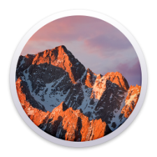

# Mac Build (using Ansible)

[](https://github.com/fgimian/campies/blob/master/LICENSE)



Artwork courtesy of [Apple](http://www.apple.com/)

## Introduction

The goal of this project is fully automate macOS workstation using Ansible.
I have currently implemented the following:

* **macOS Defaults**: Updating of plist properties for various aspects of macOS
  such as enabling zoom, configuring Finder and so on.  This uses a custom
  plist module which allows for complex updates of plist files far beyond
  the defaults command.
* **Configuration Files**: Any files that are to be copied to the Mac,
  including app settings, licenses and dotfiles.
* **Symlinks to App Configuration**: Symbolic links are created to specified
  destinations to restore more complex app settings.
* **Unix Package Installation**: This is being accomplish with the use of
  [homebrew](https://github.com/Homebrew/homebrew).
* **Terminal Customisation**: Setting up the Terminal using JXA.
* **Desktop Application Installation**: This is being performed with the use
  of [homebrew-cask](https://github.com/caskroom/homebrew-cask).
* **Music Production Software Installation**: Installation of a huge variety of
  music production software performed via my local backup drive (due to the
  fact many apps are huge or can't be downloaded directly by Homebrew Cask).
* **Appstore Application Check**: Since there is currently no way to automate
  installation of App Store applications, I perform a check to see if the app
  is installed, and notify the user that they must install it from the App
  Store if it isn't.
* **Development Setup**: Installation of development languages like Python,
  Ruby, Node.js and Go, along with development environments like Docker and
  Vagrant.  This also includes installation of related packages for each
  technology.
* **Application Settings & Licenses**: Automating configuration of Sublime 
  Text, MacDown, Textual and other applications which are of interest to me.
  This also includes deployment of licenses for any relevant software.
  This is performed using plist properties, files and custom code.

The plist module is a modified version of
[Matthias Neugebauer's plist module](https://github.com/mtneug/ansible-modules-plist).

## Quick Start

Before you get started, you may wish to perform the following steps to save
time and ensure everything works as expected:

1. Copy a Homebrew cache backup to `~/Library/Caches/Homebrew`
2. Copy App Store apps that you have previously downloaded to `/Applications`
3. Copy `System Automation` containing various settings and licenses to `~/Documents`
4. Install Apple's Command Line Tools manually to avoid them being re-downloaded

Now, run the following in your Terminal to use my configuration:

```bash
git clone https://github.com/fgimian/macbuild.git
cd macbuild
./macbuild.sh
```

It is strongly suggested that you reboot your Mac after the first run
of this.

## Manual Configuration

Some settings (outside those in the "Out of Scope") section must be set
manually due to excessive automation complexity.

### Require Manual Configuration

* **1Password**: Locate your 1Password database (this setting is stored in an
  SQLite database)
* **Chrome**: Sign in with your Google account to sync settings
* **Clear**: Enable iCloud (this triggers various actions which I can't
  automate)
* **Dropbox**: Disable camera uploads (settings are stored a binary)
* **Firefox**: Go through wizard and sign into your Firefox account
* **Spotify**: Update sources to only include iTunes (settings are stored
  in binary format)

### Require Manual Installation

* Microsoft Office
* Native Instruments Komplete
* Spectrasonics Omnisphere

### Require Manual Licensing

* Audio Hijack
* Microsoft Office
* Celemony Melodyne Editor (also requires de-activation before re-install)
* Cytomic The Drop & The Glue
* LennarDigital Sylenth1 (also requires de-activation before re-install)
* Native Instruments Komplete
* Novation Bass Station
* Spectrasonics Omnisphere

## TODO

* **Handlers**: Implementation of handlers to avoid the reboot requirement
* **LaunchPad**: Setup Launchpad with the appropriate icons and structure
* **Notification Centre**: Set the order of items and allow permission
* **App Store Login Items**: Attempt to figure out how app store apps startup automatically (e.g. AppCleaner and OneDrive)
* **Finder**: Sidebar containing favourites and view settings

* **Entropy**: I need to re-assess various options which might need enabling (e.g. auto-extract on open, sub-directory extracting .etc)
* **Forklift**: Sidebar containing favourites and view settings
* **Git**: Further aliases and touch-ups to gitconfig (possibly integrating cdiff)
* **Kitematic**: Settinsg for Kitematic are tricky as the docker role can't modify Kitematic SQL database when it hasn't been created
* **sshfs**: OSXFuse is required for sshfs but our order prevents this
* **VMware Fusion**: Software settings (see /Users/fots/Library/Preferences/VMware Fusion)
* **World Clock**: Country selection settings

* **Ableton Live Suite**: Preferences including skin selection
* **Goodhertz CanOpener**: Goodhertz installer installs more than just CanOpener
* **Apple Logic Pro X**: Preferences and key bindings
* **Steinberg Cubase Pro**: Preferences and key bindings
* **Synapse Audio DUNE**: Registration box appears during install
* **Sound Libraries**: Complete work on script to automatically install sound sample libraries and other sound sets
* **Default Plug-in Presets**: Setup default presets for your most used VST effects and instruments

## References

### Projects

* [mac-dev-playbook](https://github.com/geerlingguy/mac-dev-playbook)
* [ansible-modules-plist](https://github.com/mtneug/ansible-modules-plist)
* [legacy-common](https://github.com/osxc/legacy-common)
* [custom-ansible-osx](https://github.com/mtneug/custom-ansible-osx)

### Frameworks

* [superlumic](https://github.com/superlumic/superlumic)
* [battleschool](https://github.com/spencergibb/battleschool)
* [osxc](http://osxc.github.io/)

### Blog Posts

* [Automating your development environment with Ansible](http://www.nickhammond.com/automating-development-environment-ansible/)
* [How to automate your Mac OS X setup with Ansible](https://blog.vandenbrand.org/2016/01/04/how-to-automate-your-mac-os-x-setup-with-ansible/)
* [Using Ansible to automate OSX installs via Superlumic](http://vanderveer.be/2015/09/27/using-ansible-to-automate-osx-installs-via-superlumic.html)
* [How to Bootstrap a new OS X Environment with Ansible](http://flounderedge.com/bootstrap-new-os-x-environment-ansible/)
* [Automation of Installation on Mac w/ Ansible](https://medium.com/@hackyGQ/automation-of-installation-on-mac-w-ansible-21354cce0d7b#.j7rujxwgc)

## License

Mac Build is released under the **MIT** license. Please see the
[LICENSE](https://github.com/fgimian/macbuild/blob/master/LICENSE) file for
more details.  Feel free take what you like and use it in your own Ansible
scripts.
